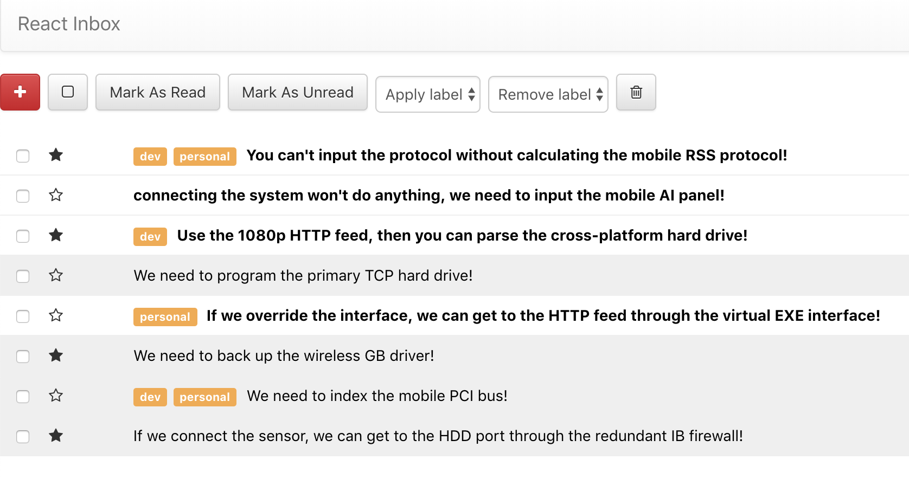

# Galvanize Reads
## Description
React Inbox is a Google Inbox clone. It allows users to send/recieve/delete messages, add/remove favorites and labels, as well as bulk select features.

### Links
  * [Deployed Front-end](https://fogle-react-inbox.herokuapp.com/)
  * [Github Front-end](https://github.com/grantfogle/react-inbox)
  * [Deployed Front-end](https://fogle-collective-api.herokuapp.com/api/messages)

### Technologies
  * React
  * Bootstrap
  * AJAX
  * JavaScript

### Preview

React Inbox: 

